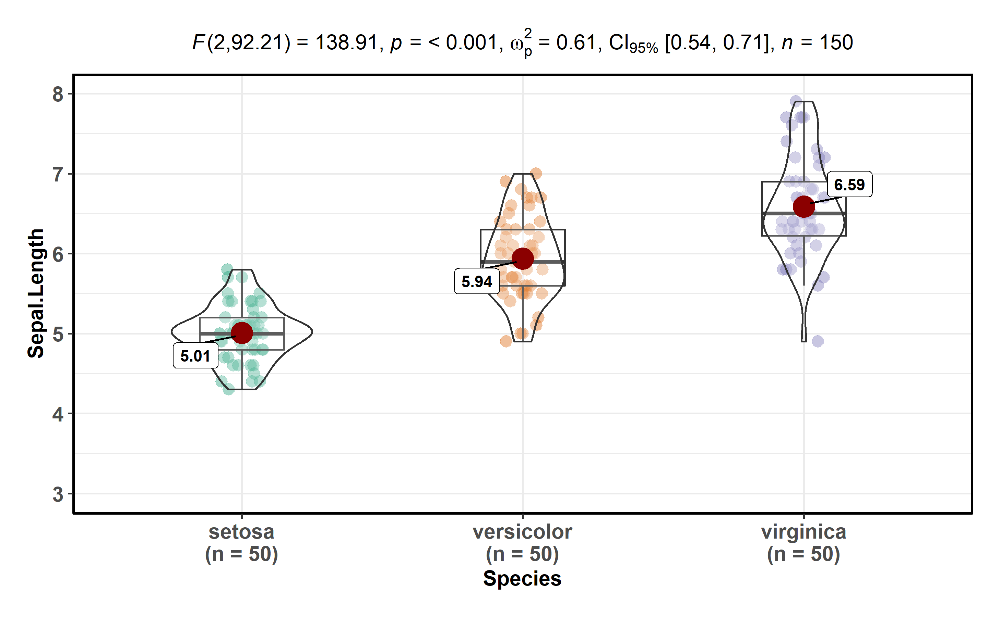
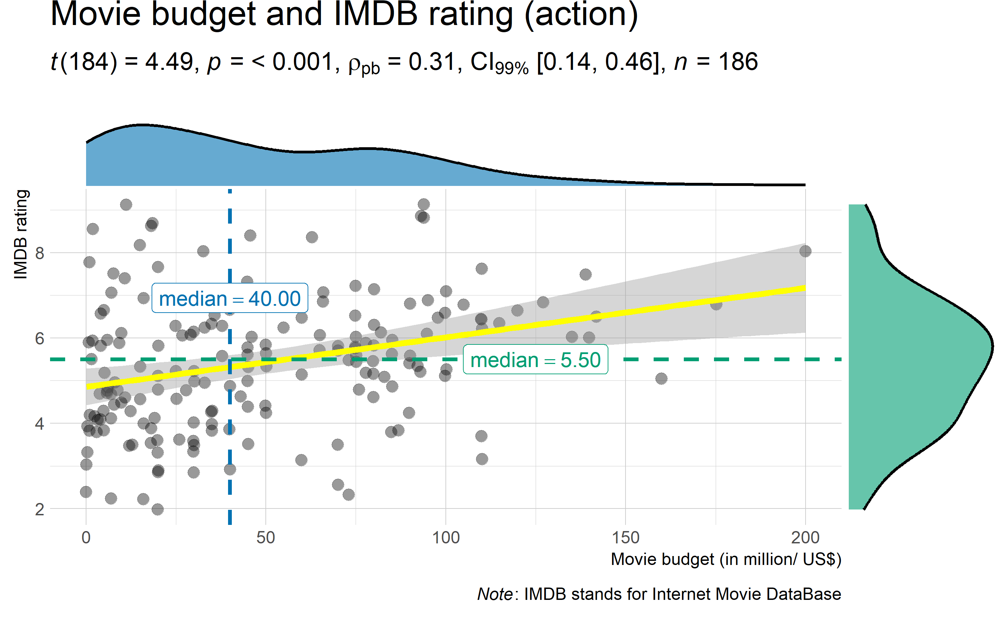
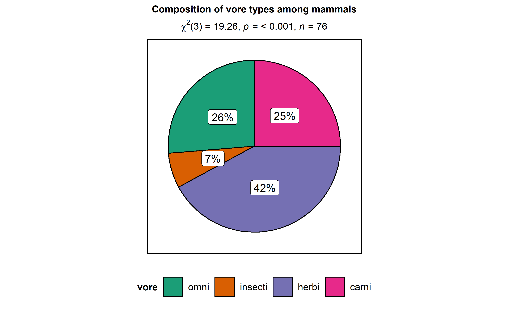
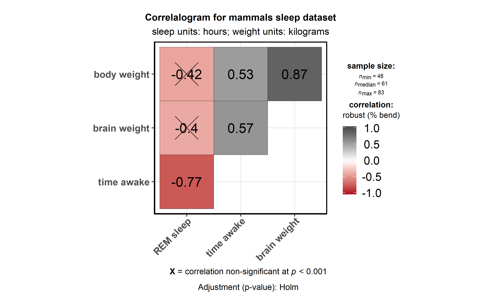

<!-- README.md is generated from README.Rmd. Please edit that file -->

# ggstatsplot: `ggplot2` Based Plots with Statistical Details

[](commits/master)
[](https://travis-ci.org/IndrajeetPatil/ggstatsplot)
[](https://ci.appveyor.com/project/IndrajeetPatil/ggstatsplot)
[](https://www.gnu.org/licenses/gpl-3.0.en.html)
[](http://www.repostatus.org/#active)
[](/commits/master)
[](https://www.tidyverse.org/lifecycle/#experimental)
[](https://cran.r-project.org/)
<!-- [](https://codecov.io/github/IndrajeetPatil/ggstatsplot?branch=master)
[](https://gemnasium.com/IndrajeetPatil/ggstatsplot) -->

## Overview

`ggstatsplot` is an extension of
[`ggplot2`](https://github.com/tidyverse/ggplot2) package for creating
graphics with details from statistical tests included in the plots
themselves and targeted primarily at behavioral sciences community to
provide a one-line code to produce information-rich figures. Currently,
it supports only the most common types of tests used in analysis
(**parametric**, **nonparametric**, and **robust** versions of
**t-tets/anova**, **correlation**, and **contingency tables** analyses).
Future versions will include other types of analyses as well.

## Installation

You can get the development version from GitHub. If you are in hurry and
want to reduce the time of installation,
prefer-

``` r
# install.packages("devtools")                                # needed package to download from GitHub repo
devtools::install_github(repo = "IndrajeetPatil/ggstatsplot", # package path on GitHub
                         quick = TRUE)                        # skips docs, demos, and vignettes
```

If time is not a
constraint-

``` r
devtools::install_github(repo = "IndrajeetPatil/ggstatsplot", # package path on GitHub
                         dependencies = TRUE,                 # installs packages which ggstatsplot depends on
                         upgrade_dependencies = TRUE          # updates any out of date dependencies
)
```

## Help

Documentation for any function can be accessed with the standard `help`
command-

``` r
?ggbetweenstats
?ggscatterstats
?gghistostats
?ggpiestats
?ggcorrmat
?combine_plots
```

## Usage

Here are examples of the main functions currently supported in
`ggstatsplot`:

  - `ggbetweenstats`

This function creates a violin plot for **between**-group or
**between**-condition comparisons with results from statistical tests in
the subtitle:

``` r
ggstatsplot::ggbetweenstats(data = iris, 
                            x = Species, 
                            y = Sepal.Length)
#> Reference:  Welch's ANOVA is used as a default. (Delacre, Leys, Mora, & Lakens, PsyArXiv, 2018).Note:  Shapiro-Wilk test of normality for Sepal.Length : p-value =  0.010Note:  Bartlett's test for homogeneity of variances for factor Species : p-value =  < 0.001
```

<!-- -->

Number of other arguments can be specified to make this plot even more
informative and, additionally, this function returns a `ggplot2` object
and thus any of the graphics layers can be further modified:

``` r
library(ggplot2)

ggstatsplot::ggbetweenstats(
  data = iris,
  x = Species,
  y = Sepal.Length,
  mean.plotting = TRUE,                           # whether mean for each group id to be displayed 
  type = "robust",                                # which type of test is to be run
  outlier.tagging = TRUE,                         # whether outliers need to be tagged
  outlier.label = Sepal.Width,                    # variable to be used for the outlier tag
  xlab = "Type of Species",                       # label for the x-axis variable
  ylab = "Attribute: Sepal Length",               # label for the y-axis variable
  title = "Dataset: Iris flower data set",        # title text for the plot
  caption = expression(                           # caption text for the plot 
    paste(italic("Note"), ": this is a demo")
    )
  ) +                                             # further modifcation outside of ggstatsplot
  ggplot2::coord_cartesian(ylim = c(3, 8)) + 
  ggplot2::scale_y_continuous(breaks = seq(3, 8, by = 1)) 
#> Note:  Shapiro-Wilk test of normality for Sepal.Length : p-value =  0.010Note:  Bartlett's test for homogeneity of variances for factor Species : p-value =  < 0.001
```

<!-- -->

Variant of this function `ggwithinstats` is currently under work.

  - `ggscatterstats`

This function creates a scatterplot with marginal
histograms/boxplots/density/violin plots from
[`ggExtra::ggMarginal()`](https://cran.r-project.org/web/packages/ggExtra/vignettes/ggExtra.html)
and results from statistical tests in the subtitle:

``` r
ggstatsplot::ggscatterstats(data = iris, 
                            x = Sepal.Length, 
                            y = Petal.Length,
                            title = "Dataset: Iris flower data set")
#> Warning: This function doesn't return ggplot2 object and is not further modifiable with ggplot2 commands.
```

<!-- -->

Number of other arguments can be specified to modify this basic plot-

``` r
library(datasets)

ggstatsplot::ggscatterstats(
  data = subset(iris, iris$Species == "setosa"),
  x = Sepal.Length,
  y = Petal.Length,
  test = "robust",                               # type of test that needs to be run
  xlab = "Attribute: Sepal Length",              # label for x axis
  ylab = "Attribute: Petal Length",              # label for y axis 
  line.colour = "darkgreen",                     # changing regression line colour line
  title = "Dataset: Iris flower data set",       # title text for the plot
  caption = expression(                          # caption text for the plot
    paste(italic("Note"), ": this is a demo")
    ),
  marginal.type = "density",                     # type of marginal distribution to be displayed
  xfill = "blue",                                # colour fill for x-axis marginal distribution 
  yfill = "red",                                 # colour fill for y-axis marginal distribution
  intercept = "median",                          # which type of intercept line is to be displayed  
  width.jitter = 0.2,                            # amount of horizontal jitter for data points
  height.jitter = 0.4                            # amount of vertical jitter for data points
  ) 
#> Note: Standardized robust regression using an M estimator: no. of iterations = 1000 In case of non-convergence, increase maxit value.Warning: This function doesn't return ggplot2 object and is not further modifiable with ggplot2 commands.
```

<!-- -->

**Important**: In contrast to all other functions in this package, the
`ggscatterstats` function returns object that is **not** further
modifiable with `ggplot2`. This can be avoided by not plotting the
marginal distributions (`marginal = FALSE`). Currently trying to find a
workaround this problem.

  - `ggpiestats`

This function creates a pie chart for categorical variables with results
from contingency table analysis included in the subtitle of the plot. If
only one categorical variable is entered, proportion test will be
carried out.

``` r
ggstatsplot::ggpiestats(data = iris,
                        main = Species)
#> Warning: No guarantee this function will work properly if you are using development version of ggplot2 (2.2.1.9000)
```

<!-- -->

This function can also be used to study an interaction between two
categorical variables. Additionally, as with the other functions in
`ggstatsplot`, this function returns a `ggplot2` object and can further
be modified with `ggplot2` syntax (e.g., we can change the color palette
*after* `ggstatsplot` has produced the plot)-

``` r
library(ggplot2)

ggstatsplot::ggpiestats(data = mtcars,
                        main = am,                
                        condition = cyl) +
  ggplot2::scale_fill_brewer(palette = "Dark2")   # further modifcation outside of ggstatsplot    
#> Warning: No guarantee this function will work properly if you are using development version of ggplot2 (2.2.1.9000)
```

<!-- -->

As with the other functions, this basic plot can further be modified
with additional arguments:

``` r
library(ggplot2)

ggstatsplot::ggpiestats(
  data = mtcars,
  main = am,
  condition = cyl,
  title = "Dataset: Motor Trend Car Road Tests",      # title for the plot
  stat.title = "interaction effect",                  # title for the results from Pearson's chi-squared test
  legend.title = "Transmission",                      # title for the legend
  factor.levels = c("0 = automatic", "1 = manual"),   # renaming the factor level names for main variable 
  facet.wrap.name = "No. of cylinders",               # name for the facetting variable
  caption = expression(                               # text for the caption
    paste(italic("Note"), ": this is a demo")
    )
) 
#> Warning: No guarantee this function will work properly if you are using development version of ggplot2 (2.2.1.9000)
```

<!-- -->

  - `gghistostats`

In case you would like to see the distribution of one variable and check
if it is significantly different from a specified value with a one
sample test, this function will let you do that.

``` r
library(datasets)
library(viridis)

ggstatsplot::gghistostats(
  data = iris,
  x = Sepal.Length,
  title = "Distribution of Iris sepal length",
  type = "parametric",            # one sample t-test
  test.value = 3,                 # default value is 0
  centrality.para = "mean",       # which measure of central tendency is to be plotted
  centrality.colour = "red",      # decides colour of vertical line representing central tendency
  density.plot = TRUE,            # whether density plot is to be overlayed on a histogram
  binwidth.adjust = TRUE,         # whether binwidth needs to be adjusted
  binwidth = 0.10                 # binwidth value (needs to be toyed around with until you find the best one)
) +              
  viridis::scale_fill_viridis()   # further modifcation outside of ggstatsplot
#> Note:  Shapiro-Wilk test of normality for Sepal.Length : p-value =  0.010
```

<!-- -->

  - `ggcorrmat`

`ggcorrmat` makes correlalograms with minimal amount of code. Just
sticking to the defaults itself produces publication-ready correlation
matrices. (Wrapper around
[`ggcorrplot`](https://github.com/kassambara/ggcorrplot))

``` r
library(plyr)

# creating a list of plots
plots <- plyr::dlply(
  .data = iris,
  .variables = .(Species),  # creates the ggcorrmat for each level of Species factor
  .fun = function(data)
    ggstatsplot::ggcorrmat(
      data = data,
      cor.vars = c(Sepal.Length, Sepal.Width, Petal.Length, Petal.Width),
      cor.vars.names = c("Sepal Length", "Sepal Width", "Petal Length", "Petal Width"),
      title = glue::glue("Species: {data$Species}")
    )
)

# combining the individual correlalograms into a single plot
 ggstatsplot::combine_plots(
    plotlist = plots,
    nrow = 3,
    ncol = 1,
    labels = c("(a)", "(b)", "(c)", "(d)"),
    title.text = "Correlalogram for length measures for all Iris species",
    title.colour = "blue",
    caption.text = expression(
        paste(
          italic("Note"),
          ": X denotes correlation non-significant at ",
          italic("p "),
          "< 0.05; unadjusted"
        )
      )
  )
```

<!-- -->

Alternatively, you can use it just to get the correlation matrices and
their corresponding p-values (in a
[tibble](http://tibble.tidyverse.org/) format).

``` r
# getting correlations 
ggstatsplot::ggcorrmat(
  data = iris,
  cor.vars = c(Sepal.Length, Sepal.Width, Petal.Length, Petal.Width),
  output = "correlations"
)
#> # A tibble: 4 x 5
#>   variable     Sepal.Length Sepal.Width Petal.Length Petal.Width
#>   <chr>               <dbl>       <dbl>        <dbl>       <dbl>
#> 1 Sepal.Length        1.00       -0.120        0.870       0.820
#> 2 Sepal.Width        -0.120       1.00        -0.430      -0.370
#> 3 Petal.Length        0.870      -0.430        1.00        0.960
#> 4 Petal.Width         0.820      -0.370        0.960       1.00

# getting p-values
ggstatsplot::ggcorrmat(
  data = iris,
  cor.vars = c(Sepal.Length, Sepal.Width, Petal.Length, Petal.Width),
  output = "p-values"
)
#> # A tibble: 4 x 5
#>   variable     Sepal.Length  Sepal.Width Petal.Length Petal.Width
#>   <chr>               <dbl>        <dbl>        <dbl>       <dbl>
#> 1 Sepal.Length     0.       0.152            1.04e-47    2.33e-37
#> 2 Sepal.Width      1.52e- 1 0.               4.51e- 8    4.07e- 6
#> 3 Petal.Length     1.04e-47 0.0000000451     0.          4.68e-86
#> 4 Petal.Width      2.33e-37 0.00000407       4.68e-86    0.
```

  - `combine_plots`

`ggstatsplot` also contains a helper function `combine_plots` to combine
multiple plots. This is a wrapper around
[`cowplot::plot_grid`](https://cran.r-project.org/web/packages/cowplot/vignettes/plot_grid.html)
and lets you combine multiple plots and add combination of title,
caption, and annotation texts with suitable default parameters.

``` r
library(ggplot2)
library(plyr) 
library(glue)

ggstatsplot::combine_plots(
  plotlist = plyr::dlply(
    .data = iris,
    .variables = .(Species),
    .fun = function(data)
      ggstatsplot::ggscatterstats(
        data = data,
        x = Sepal.Length,
        y = Sepal.Width,
        marginal.type = "boxplot",
        title =
          glue::glue("Species: {(data$Species)} (n = {length(data$Sepal.Length)})")
      )
  ),
  labels = c("(a)", "(b)", "(c)"),
  nrow = 3,
  ncol = 1,
  title.text = "Relationship between sepal length and width for all Iris species",
  title.size = 14,
  title.colour = "blue",
  caption.text = expression(
    paste(
      italic("Note"),
      ": Iris flower dataset was collected by Edgar Anderson."
    ),
    caption.size = 10
  )
)
#> Warning: This function doesn't return ggplot2 object and is not further modifiable with ggplot2 commands.Warning: This function doesn't return ggplot2 object and is not further modifiable with ggplot2 commands.Warning: This function doesn't return ggplot2 object and is not further modifiable with ggplot2 commands.
```

<!-- -->

The full power of `ggstatsplot` can be leveraged with a functional
programming package like [`purrr`](http://purrr.tidyverse.org/) that
replaces many for loops with code that is both more succinct and easier
to read. Although `plyr` was used to carry out looped operations in
prior examples, `purrr` should be preferrred.

An example is provided below. Notice how little code is needed not only
to prepare the plots but also to plot the statistical test results.

``` r
library(tidyverse)
library(glue)

### creating a list column with `ggstatsplot` plots
plots <- datasets::mtcars %>%
  dplyr::mutate(.data = ., cyl2 = cyl) %>%        # just creates a copy of this variable
  dplyr::group_by(.data = ., cyl) %>%             # 
  tidyr::nest(data = .) %>%                       # creates a nested dataframe with list column called `data`
  dplyr::mutate(                                  # creating a new list column of ggstatsplot outputs
    .data = .,
    plot = data %>%
      purrr::map(
        .x = .,
        .f = ~ ggstatsplot::ggbetweenstats(
          data = .,
          x = am,
          y = mpg,
          xlab = "Transmission",
          ylab = "Miles/(US) gallon",
          title = glue::glue(
            "Number of cylinders: {.$cyl2}"        # this is where the duplicated cyl2 column is useful
            ) 
        )
      )
  )
#> Warning:  aesthetic `x` was not a factor; converting it to factorReference:  Welch's t-test is used as a default. (Delacre, Lakens, & Leys, International Review of Social Psychology, 2017).Note:  Shapiro-Wilk test of normality for mpg : p-value =  0.325Note:  Bartlett's test for homogeneity of variances for factor am : p-value =  0.317Warning:  aesthetic `x` was not a factor; converting it to factorReference:  Welch's t-test is used as a default. (Delacre, Lakens, & Leys, International Review of Social Psychology, 2017).Note:  Shapiro-Wilk test of normality for mpg : p-value =  0.261Note:  Bartlett's test for homogeneity of variances for factor am : p-value =  0.144Warning:  aesthetic `x` was not a factor; converting it to factorReference:  Welch's t-test is used as a default. (Delacre, Lakens, & Leys, International Review of Social Psychology, 2017).Note:  Shapiro-Wilk test of normality for mpg : p-value =  0.323Note:  Bartlett's test for homogeneity of variances for factor am : p-value =  0.201

### display the new object (notice that the class of the `plot` list column is S3: gg)
plots
#> # A tibble: 3 x 3
#>     cyl data               plot    
#>   <dbl> <list>             <list>  
#> 1    6. <tibble [7 x 11]>  <S3: gg>
#> 2    4. <tibble [11 x 11]> <S3: gg>
#> 3    8. <tibble [14 x 11]> <S3: gg>

### creating a grid with cowplot
ggstatsplot::combine_plots(plotlist = plots$plot,       # list column containing all ggstatsplot objects
                           nrow = 3,
                           ncol = 1,
                           labels = c("(a)","(b)","(c)"),
                           title.text = "MPG and car transmission relationship (for each cylinder count)",
                           title.size = 13,
                           title.colour = "blue",
                           caption.text = expression(
                             paste(
                               italic("Transmission"),
                               ": 0 = automatic, 1 = manual"
                             ),
                             caption.size = 10
                           ))
```

<!-- -->

  - `theme_mprl`

`ggstatsplot` uses a default theme `theme_mprl()` that can be used with
any `ggplot2` objects.

``` r
library(ggplot2)

# Basic scatter plot
ggplot(mtcars, aes(x = wt, y = mpg)) + 
  geom_point()
```

<!-- -->

``` r
# Basic scatter plot with theme_mprl() added
ggplot(mtcars, aes(x = wt, y = mpg)) + 
  geom_point() + 
  ggstatsplot::theme_mprl()
```

<!-- -->

Please note that this project is released with a [Contributor Code of
Conduct](https://github.com/IndrajeetPatil/ggstatsplot/blob/master/CONDUCT.md).
By participating in this project you agree to abide by its terms.
